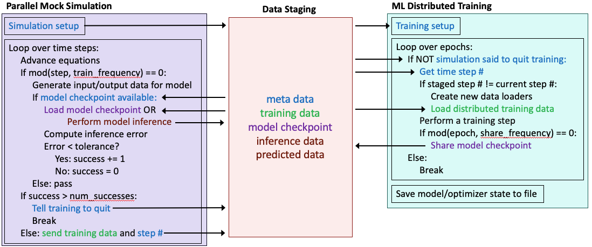

# SimAI-Bench
Performance benchmarks for coupled simulation and AI workflows on HPC systems

## Description

The goal of SimAI-Bench is to host a series of micro, mini, and full benchmarks for various coupled simulation and AI/ML workflow motifs designed for leadership HPC systems.
These benchmarks may be used to evaluate the performance and scalability of different workflow libraries or compare the same workflow motif across different hardware.

The benchmarks below are named according [Brewer et al., 2024](https://arxiv.org/pdf/2406.14315), which organized coupled workflows into six motifs based on their goals and data transfer patterns. 

### Motif 6: Online Training of Mesh-Based ML Surrogates

The first mini-benchmark is representative of an [online training](./src/online_training) and inference workflow for developing mesh-based ML surrogate models from ongoing HPC simulations.
Referring to [Brewer et al., 2024](https://arxiv.org/pdf/2406.14315), this falls motif #6: Adaptive training of large AI models. 

The focus of this mini-benchmark is to replicate the data transfer patterns and key components of a realistic workflow, but removing the complexities involved with compiling and running complex simulation codes. 
Is is composed of a mock parallel simulation which performs a time step loop, advancing the system dynamics, and at pre-determined intervals (selected at runtime) transfers training data to either the training component or a staging area. The simulation also receives model checkpoints and performs inference with the ML surrogate, comparing the predicted solution field with the true one, and thus determining whether more training is needed or if the accuracy required tolerance is met, at which point the workflow ends.
The distributed ML training component is training the ML surrogate from the incoming data sent by the simulation, checking for updates each epoch and loading the new data as it is generated. The training component preriodically saves model checkpoints and sends them to the simulation.
Depending on the implementation used, a third component is also present in the form of a staging area (e.g., SmartSim Orchestrator or Dragon Distributed Dictionary). 

The mini-benchmark is currently implemented using the SmartSim/SmartRedis and Dragon libraries, each providing both the workflow driver API and the client API. Both of these implementations use a staging area to store meta-data, training data, and model checkpoints. Which implementation to run with can be selected at runtime.
Additionally, it can be launched with either a colocated deployment strategy (i.e., all components run on the same set of nodes) or a clustered strategy (i.e., all components run on distinct set of nodes from each other). The strategy can also be selected at runtime.

The benchmark focuses on the data transfer between the different components and provides figures of merit (FOM) capturing the workflow overhead on both the mock simulation and training, broken down by category, thus captiring the effectiveness of the workflow.

## Software Dependencies

### AI/ML

* PyTorch
* PyTorch Geometric and PyTorch Cluster

### Workflows

* [SmartSim](https://github.com/CrayLabs/SmartSim) and [SmartRedis](https://github.com/CrayLabs/SmartRedis)
* [Dragon](https://github.com/DragonHPC/dragon)

### Other

* mpi4py
* [MPIPartition](https://github.com/ArgonneCPAC/MPIPartition)

## Installation

### ALCF Polaris

## Usage Example

### Online Training of ML Surrogates

## Release History

* 0.0.1
    * Added an online training workflow for ML surrogate models implemented with SmartSim and Dragon
    * Tested on ALCF Polaris

## Contributing

1. Fork it (<https://github.com/argonne-lcf/SimAI-Bench/fork>)
2. Cline it (`git clone https://github.com/username/SimAI-Bench.git`)
2. Create your feature branch (`git checkout -b feature/fooBar`)
3. Commit your changes (`git commit -am 'Add some fooBar'`)
4. Push to the branch (`git push -u origin feature/fooBar`)
5. Create a new Pull Request

## Contributors

Riccardo Balin, Argonne National Lab, rbalin@anl.gov

Shivam Barwey, Argonne National Lab, sbarwey@anl.gov

