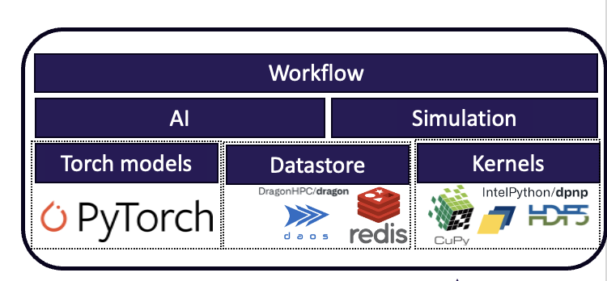

# SimAI-Bench
Performance benchmarks for coupled AI and simulation workflows on HPC systems.


## Description

SimAI-Bench is a flexible and extensible interface for emulating, benchmarking, and prototyping AI-coupled HPC workflows.
With its easy-to-use Python packages and intuitive API, SimAI-Bench allows users to compose faithful mini-apps of their full end-to-end workflows with diverse simulation and AI components and multiple in situ or in transit data transfer patterns.


<center>



</center>

SimAI-Bench is composed of the following modules:

* *Kernel*: The `Kernel` module, adapted from the [workflow-mini-API](https://ieeexplore.ieee.org/document/10701365), provides primitives for key compute, IO, communication, and copy operations. It leverages CuPy and dpnp for compute and copy operations on NVIDIA, AMD and Intel GPUs, mpi4py for communication across ranks, and HDF5 for I/O operations to the disk.
* *torch.nn*: SimAI-Bench leverages the `torch.nn` module in PyTorch to execute ML kernels or build ML models of various architecture.
* *ServerManager* and *DataStore*: The `ServerManager` and `DataStore` classes provide a unified interface for data staging and streaming through various approaches and software libraries, also referred to as data transport backends. SimAI-Bench currently supports data staging through Redis, DragonHPC, the parallel file system, DAOS, and high-performance node-local flash storage or RAM memory. The `ServerManager` is used to initialize and manage the resources of a particular backend, whereas the `DataStore` provides unified client API which enable the data to be transferred between any workflow component.
* *Simulation*: The `Simulation` class is the main component that emulates traditional HPC simulation components within AI-coupled workflows. It uses the underlying `Kernels` to emulate the computational and communication aspects, and the `DataStore` module to interact with the data staging backends. A simulation is configured using a Python dictionary or a JSON file that specifies all the necessary parameters.
* *AI*: The `AI` class is used to model the machine learning portions of the workflow by leveraging the `torch.nn` and `torch.distributed` modules in PyTorch. Similarly to the `Simulation` class, it can use the `DataStore` API to stage and stream data to other workflow components.
* *Workflow*:  At the highest level, the `Workflow` class provides the functionality to compose a workflow from various `Simulation` and `AI` components and deploy it on an HPC system with the desired data transport strategy.
* *Orchestrator*: The `Orchestrator` module provides the core workflow execution engine that manages task scheduling, dependency resolution, and resource allocation. It supports multiple execution backends including:
  * Thread pools
  * Process pools
  * Dask
  * Taskvine
  * Ray
  * Parsl 
  Above integration are provided with [TAPS](https://github.com/proxystore/taps). In addition, we also provide integration with [DragonHPC](https://dragonhpc.org/portal/index.html).
* *Profiling*: The `Profiling` module offers comprehensive performance monitoring and analysis capabilities. It tracks task execution times, resource utilization, and workflow bottlenecks through a plugin-based architecture that can be extended with custom metrics and analysis tools.


## Installation

### ALCF Aurora

To install SimAI-Bench on Aurora with all of its required dependencies, clone and install the project locally with `pip` after creating a Python virtual environment

```bash
module load frameworks
python -m venv _simai --system-site-packages
. _simai/bin/activate

git clone https://github.com/argonne-lcf/SimAI-Bench.git
cd SimAI-Bench
pip install .
```

To configure the DragonHPC's high-speed transport agent (HSTA) to use Libfabric on Aurora, execute
```bash
dragon-config -a "ofi-runtime-lib=/opt/cray/libfabric/1.22.0/lib64"
```

## Examples

### Basic: Two-component workflow with staging through the file system and a task dependency

This example demonstrates how to use the SimAI-Bench modules to create a simple workflow with two simulation components, sharing data through the file system and with a task dependency.

```python
from SimAIBench import Workflow, Simulation, ServerManager, server_registry
from SimAIBench import OchestratorConfig, SystemConfig

# Initialize the server for data staging
server_config = server_registry.create_config("filesystem")
server = ServerManager("server", config=server_config)
server.start_server()
server_info = server.get_server_info()

# Initialize the workflow with orchestrator and system configurations
orchestrator_config = OchestratorConfig(name="thread-pool")
system_config = SystemConfig(name="local", ncpus=4, ngpus=0)

w = Workflow(orchestrator_config=orchestrator_config, system_config=system_config)

# Add the first simulation component to the workflow
@w.component(name="sim",
             type="remote", # set remote execution, meaning launching through mpirun/mpiexec, needed for multi-node or MPI components
             args={"server_info": server_info})
def run_sim(server_info: dict):
  sim = Simulation(name="sim",
                   server_info=server_info)
  sim.add_kernel("MatMulSimple2D")
  sim.run()
  sim.stage_write("key", "value") # write data to the staging backend

# Add the second simulation component to the workflow
@w.component(name="sim2", 
             type="local", # set local execution, meaning launching through Python mp.Process on the local node
             args={"server_info": server_info},
             dependencies=["sim"]) # set a dependency on the first simulation component
def run_sim2(server_info: dict):
  sim = Simulation(name="sim2",
                   server_info=server_info)
  sim.add_kernel("MatMulGeneral")
  value = sim.stage_read("key") # read data from the staging backend
  sim.run()

# Execute the workflow
w.launch()

# Stop the server
server.stop_server()
```

### Advanced: Dynamic workflow with runtime task generation

This example demonstrates a more advanced use case where tasks are generated dynamically at runtime. This is useful for adaptive workflows where the number and structure of tasks depend on runtime conditions or results from previous computations.

In this example, a parent task dynamically creates a chain of dependent tasks that sequentially process data. Each task reads data from the staging backend, validates it, appends to it, and writes it back for the next task in the chain.

```python
from SimAIBench import ServerManager, server_registry, OchestratorConfig, SystemConfig
from SimAIBench.orchestrator import Orchestrator, OrchetratorClient
from SimAIBench.component import WorkflowComponent
from SimAIBench.datastore import DataStore
import time

# Define a parent task that dynamically generates child tasks
def dynamic_sim(client: OrchetratorClient, server_info: dict, ntasks: int = 10):
    """
    A task that dynamically generates a chain of dependent tasks at runtime.
    Each child task reads data, validates it, modifies it, and writes it back.
    """
    # Initialize data store and write initial value
    ds = DataStore("ds", server_info=server_info)
    ds.stage_write("key", "sim")
    
    # Define the child task function
    def sub_sim(simid: int, ds: DataStore):
        import time
        # Read current value from staging backend
        value = ds.stage_read("key")
        
        # Validate the expected value based on task sequence
        expected = "sim" + "".join([f"-sim{i}" for i in range(simid)])
        assert value == expected, f"{value} != {expected}"
        
        # Append task identifier and write back
        ds.stage_write("key", value + f"-sim{simid}")
        time.sleep(1)
    
    # Dynamically create a chain of tasks with dependencies
    futures = []
    for i in range(ntasks):
        # Set dependency on previous task (except first task)
        dependencies = [f"sim{i-1}"] if i > 0 else []
        
        # Submit task to orchestrator
        future = client.submit(
            WorkflowComponent(
                f"sim{i}",
                sub_sim,
                type="local",
                args={"simid": i, "ds": ds},
                dependencies=dependencies
            )
        )
        futures.append(future)
    
    # Wait for all tasks to complete
    while not all([future.done() for future in futures]):
        time.sleep(5)

# Initialize data staging server
server_config = server_registry.create_config("filesystem")
server = ServerManager("server", server_config)
server.start_server()
server_info = server.get_server_info()

# Create orchestrator configurations
orchestrator_config = OchestratorConfig(name="thread-pool", profile=False)
system_config = SystemConfig(name="local", ncpus=12, ngpus=0)

# Start the orchestrator manually for dynamic workflow control
orchestrator = Orchestrator(system_config, orchestrator_config)
client = orchestrator.start()

# Submit the parent task that will generate child tasks dynamically
component = WorkflowComponent(
    "sim",
    executable=dynamic_sim,
    type="local",
    args={"client": client, "server_info": server_info, "ntasks": 10}
)

future = client.submit(component)

# Wait for completion
while not future.done():
    print("Waiting for workflow completion...")
    time.sleep(10)

# Cleanup
orchestrator.wait(timeout=10)
orchestrator.stop()
server.stop_server()
```

**Key differences in dynamic workflows:**

1. **Manual orchestrator management**: Instead of using the `Workflow` class, you directly instantiate and manage the `Orchestrator` to get access to the `OrchetratorClient` for submitting tasks at runtime.

2. **Runtime task submission**: Tasks can submit other tasks during their execution using `client.submit()`, enabling adaptive workflow patterns.

3. **WorkflowComponent API**: Components are created using the `WorkflowComponent` class directly, providing more fine-grained control over task properties and dependencies.

4. **Use cases**: Dynamic workflows are ideal for:
   - Adaptive simulations where the next steps depend on current results
   - Ensemble workflows with variable member counts
   - Iterative refinement loops
   - Complex DAGs that are determined at runtime


## Contributing

1. Fork it (<https://github.com/argonne-lcf/SimAI-Bench/fork>)
2. Clone it (`git clone https://github.com/username/SimAI-Bench.git`)
3. Create your feature branch (`git checkout -b feature/fooBar`)
4. Commit your changes (`git commit -am 'Add some fooBar'`)
5. Push to the branch (`git push -u origin feature/fooBar`)
6. Create a new Pull Request


## Contributors

Harikrishna Tummalapalli, Argonne National Lab, htummalapalli@anl.gov

Riccardo Balin, Argonne National Lab, rbalin@anl.gov

Christine Simpson, Argonne National Lab, csimpson@anl.gov


